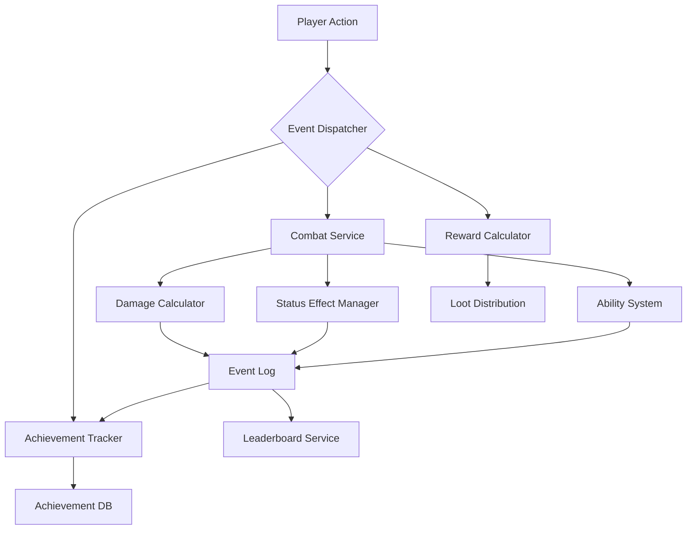
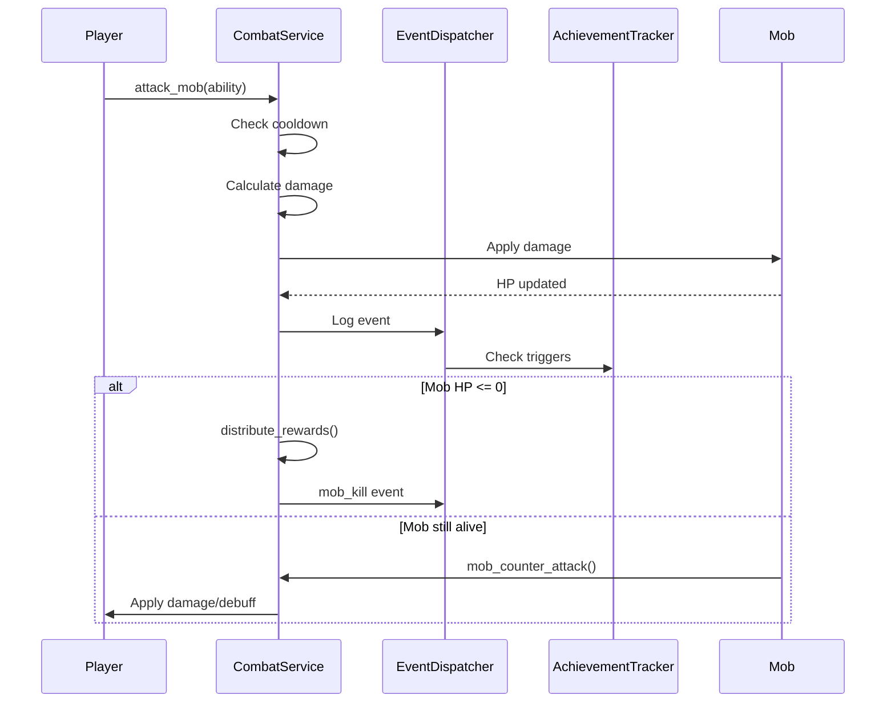
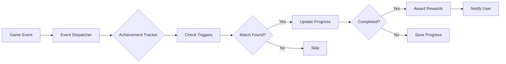

# aROMaBot - Architettura RPG Asincrono

> **Game Design Document & Technical Architecture**  
> *Un RPG testuale asincrono per Telegram con meccaniche avanzate, boss raid, achievement system ed eventi speciali*

---

## 📋 Indice

1. [Panoramica Sistema](#panoramica-sistema)
2. [Data Models](#data-models)
3. [Combat System](#combat-system)
4. [Reward Distribution](#reward-distribution)
5. [Achievement System](#achievement-system)
6. [Boss & Raid Mechanics](#boss--raid-mechanics)
7. [Event System](#event-system)
8. [Special Events](#special-events)
9. [Implementation Examples](#implementation-examples)

---

## 🎮 Panoramica Sistema

### Filosofia di Design
- **Asincrono**: Combattimenti a turni con cooldown, nessuna presenza simultanea richiesta
- **Cooperativo**: Ricompense basate sul contributo, non winner-takes-all
- **Progressivo**: Sistema di crescita multi-livello (player, character, abilities)
- **Ironico ma Tecnico**: Meccaniche serie con flavor text divertente

### Architettura Modulare



---

## 📊 Data Models

### 1. Player (Extended Utente Model)

```python
class Utente(Base):
    """Enhanced player model with RPG stats"""
    __tablename__ = "utente"
    
    # Base Info (existing)
    id = Column(Integer, primary_key=True)
    id_telegram = Column(Integer, unique=True)
    nome = Column(String(32))
    cognome = Column(String(32))
    username = Column(String(32), unique=True)
    
    # Progression (existing)
    exp = Column(Integer, default=0)
    points = Column(Integer, default=0)  # Wumpa coins
    livello = Column(Integer, default=1)
    
    # Combat Stats (existing + new)
    health = Column(Integer, default=100)
    max_health = Column(Integer, default=100)
    current_hp = Column(Integer, default=100)
    mana = Column(Integer, default=50)
    max_mana = Column(Integer, default=50)
    current_mana = Column(Integer, default=50)
    base_damage = Column(Integer, default=10)
    
    # Allocated Stats (existing)
    allocated_health = Column(Integer, default=0)
    allocated_mana = Column(Integer, default=0)
    allocated_damage = Column(Integer, default=0)
    allocated_speed = Column(Integer, default=0)
    allocated_resistance = Column(Integer, default=0)
    allocated_crit_rate = Column(Integer, default=0)
    
    # Combat Timing
    last_attack_time = Column(DateTime, nullable=True)
    last_health_restore = Column(DateTime, nullable=True)
    
    # Status Effects (NEW)
    active_status_effects = Column(String, nullable=True)  # JSON: [{effect, duration, stacks}]
    
    # Character Selection (existing)
    livello_selezionato = Column(Integer)
    last_character_change = Column(DateTime, nullable=True)
    
    # Premium & Buffs (existing)
    premium = Column(Integer, default=0)
    scadenza_premium = Column(DateTime, nullable=True)
    invincible_until = Column(DateTime, nullable=True)
    luck_boost = Column(Integer, default=0)
```

### 2. Mob (Enhanced Model)

```python
class Mob(Base):
    """Enhanced mob with abilities and AI"""
    __tablename__ = "mob"
    
    id = Column(Integer, primary_key=True)
    name = Column(String, nullable=False)
    
    # Health & Status
    health = Column(Integer, nullable=False)
    max_health = Column(Integer, nullable=False)
    is_dead = Column(Boolean, default=False)
    
    # Combat Stats (existing)
    mob_level = Column(Integer, default=1)
    attack_type = Column(String, default="physical")
    attack_damage = Column(Integer, default=10)
    speed = Column(Integer, default=30)
    resistance = Column(Integer, default=0)
    difficulty_tier = Column(Integer, default=1)
    
    # Boss Flag
    is_boss = Column(Boolean, default=False)
    
    # Timing
    spawn_time = Column(DateTime, default=datetime.datetime.now)
    last_attack_time = Column(DateTime, nullable=True)
    
    # Rewards
    killer_id = Column(Integer, nullable=True)
    reward_claimed = Column(Boolean, default=False)
    
    # NEW: Advanced Mechanics
    passive_abilities = Column(String, nullable=True)  # JSON array of ability IDs
    active_abilities = Column(String, nullable=True)   # JSON array of ability IDs
    ai_behavior = Column(String, default="aggressive")  # aggressive, defensive, tactical
    phase_thresholds = Column(String, nullable=True)   # JSON: {50: "phase2", 25: "phase3"}
    current_phase = Column(Integer, default=1)
    
    # Buffs/Debuffs
    active_buffs = Column(String, nullable=True)  # JSON: [{buff_type, value, duration}]
    
    # Visual
    image_path = Column(String, nullable=True)
    description = Column(String, nullable=True)
```

### 3. MobAbility (NEW)

```python
class MobAbility(Base):
    """Defines abilities that mobs can use"""
    __tablename__ = "mob_ability"
    
    id = Column(Integer, primary_key=True)
    name = Column(String, nullable=False)
    ability_type = Column(String, nullable=False)  # passive, active, trigger
    
    # Damage/Effect
    damage = Column(Integer, default=0)
    damage_type = Column(String, default="physical")
    
    # Targeting
    target_type = Column(String, default="single")  # single, aoe, random, lowest_hp
    max_targets = Column(Integer, default=1)
    
    # Trigger Conditions (for trigger-type abilities)
    trigger_condition = Column(String, nullable=True)  # hp_below_50, on_hit, every_3_turns
    trigger_chance = Column(Integer, default=100)  # Percentage
    
    # Effects
    status_effect = Column(String, nullable=True)  # stun, burn, confusion, mind_control
    status_duration = Column(Integer, default=0)  # turns
    status_chance = Column(Integer, default=0)
    
    # Buffs (self-buff for passive abilities)
    buff_type = Column(String, nullable=True)  # defense, evasion, damage_reflect
    buff_value = Column(Integer, default=0)
    buff_duration = Column(Integer, default=0)  # 0 = permanent while alive
    
    # Cooldown
    cooldown_turns = Column(Integer, default=0)
    
    # Description
    description = Column(String, nullable=True)
    flavor_text = Column(String, nullable=True)  # For comedic effect
```

**Example Abilities:**

```json
{
  "id": 1,
  "name": "Scudo Impenetrabile",
  "ability_type": "passive",
  "buff_type": "defense",
  "buff_value": 30,
  "description": "Riduce tutti i danni del 30%"
}

{
  "id": 2,
  "name": "Controllo Mentale",
  "ability_type": "active",
  "target_type": "random",
  "status_effect": "mind_control",
  "status_duration": 2,
  "status_chance": 40,
  "cooldown_turns": 5,
  "flavor_text": "Il boss ti guarda negli occhi... improvvisamente attacchi i tuoi compagni!"
}

{
  "id": 3,
  "name": "Furia Crescente",
  "ability_type": "trigger",
  "trigger_condition": "hp_below_50",
  "buff_type": "damage",
  "buff_value": 50,
  "description": "Sotto il 50% HP, aumenta il danno del 50%"
}
```

### 4. CombatParticipation (Enhanced)

```python
class CombatParticipation(Base):
    """Tracks player contribution to mob/boss fights"""
    __tablename__ = "combat_participation"
    
    id = Column(Integer, primary_key=True)
    mob_id = Column(Integer, ForeignKey('mob.id'))
    user_id = Column(Integer, nullable=False)  # id_telegram
    
    # Damage Tracking
    damage_dealt = Column(Integer, default=0)
    hits_landed = Column(Integer, default=0)
    critical_hits = Column(Integer, default=0)
    
    # Support Tracking
    healing_done = Column(Integer, default=0)
    buffs_applied = Column(Integer, default=0)
    
    # Rewards
    exp_earned = Column(Integer, default=0)
    loot_received = Column(String, nullable=True)  # JSON array of items
    reward_claimed = Column(Boolean, default=False)
    
    # Timestamps
    first_hit_time = Column(DateTime, nullable=True)
    last_hit_time = Column(DateTime, nullable=True)
```

### 5. Achievement System (NEW)

```python
class Achievement(Base):
    """Defines available achievements"""
    __tablename__ = "achievement"
    
    id = Column(Integer, primary_key=True)
    achievement_key = Column(String, unique=True, nullable=False)  # e.g., "first_blood"
    name = Column(String, nullable=False)
    description = Column(String, nullable=False)
    
    # Category
    category = Column(String, nullable=False)  # combat, damage, support, meme, special
    
    # Progression
    tier = Column(String, default="bronze")  # bronze, silver, gold, platinum
    is_progressive = Column(Boolean, default=False)  # Can be earned multiple times
    max_progress = Column(Integer, default=1)  # For progressive achievements
    
    # Trigger
    trigger_event = Column(String, nullable=False)  # mob_kill, damage_dealt, crit_hit
    trigger_condition = Column(String, nullable=True)  # JSON: {min_damage: 1000}
    
    # Rewards
    reward_points = Column(Integer, default=0)
    reward_title = Column(String, nullable=True)
    cosmetic_reward = Column(String, nullable=True)  # Badge, icon, etc.
    
    # Display
    icon = Column(String, nullable=True)
    hidden = Column(Boolean, default=False)  # Hidden until unlocked
    
    # Flavor
    flavor_text = Column(String, nullable=True)


class UserAchievement(Base):
    """Tracks user achievement progress"""
    __tablename__ = "user_achievement"
    
    id = Column(Integer, primary_key=True)
    user_id = Column(Integer, nullable=False)  # id_telegram
    achievement_id = Column(Integer, ForeignKey('achievement.id'))
    
    # Progress
    current_progress = Column(Integer, default=0)
    is_completed = Column(Boolean, default=False)
    completion_date = Column(DateTime, nullable=True)
    
    # Metadata
    times_earned = Column(Integer, default=0)  # For repeatable achievements
    last_progress_update = Column(DateTime, default=datetime.datetime.now)
```

### 6. GameEvent (NEW - Event Tracking)

```python
class GameEvent(Base):
    """Logs all significant game events for achievement tracking"""
    __tablename__ = "game_event"
    
    id = Column(Integer, primary_key=True)
    event_type = Column(String, nullable=False)  # mob_kill, damage_dealt, crit_hit, etc.
    user_id = Column(Integer, nullable=True)  # Can be null for system events
    
    # Event Data
    event_data = Column(String, nullable=True)  # JSON with event-specific data
    
    # Context
    mob_id = Column(Integer, nullable=True)
    combat_id = Column(Integer, nullable=True)
    
    # Timestamp
    timestamp = Column(DateTime, default=datetime.datetime.now)
    
    # Processing
    processed_for_achievements = Column(Boolean, default=False)
```

**Event Data Examples:**

```json
// Mob Kill Event
{
  "event_type": "mob_kill",
  "user_id": 12345,
  "event_data": {
    "mob_name": "Drago Antico",
    "mob_level": 15,
    "is_boss": true,
    "damage_dealt": 2500,
    "was_last_hit": true,
    "solo_kill": false
  }
}

// Critical Hit Event
{
  "event_type": "critical_hit",
  "user_id": 12345,
  "event_data": {
    "damage": 450,
    "multiplier": 2.5,
    "ability_used": "Kamehameha"
  }
}

// Damage Milestone Event
{
  "event_type": "damage_milestone",
  "user_id": 12345,
  "event_data": {
    "total_damage": 10000,
    "milestone": 10000
  }
}
```
---

## ⚔️ Combat System

### Combat Flow



### Damage Calculation Algorithm

```python
def calculate_damage(attacker, defender, ability=None, is_special=False):
    """
    Enhanced damage calculation with elemental types, crits, and resistances
    """
    # Base damage
    base_dmg = attacker.base_damage + attacker.allocated_damage
    
    # Ability modifier
    if ability:
        base_dmg += ability.damage
        elemental_type = ability.elemental_type
    else:
        elemental_type = attacker.elemental_type
    
    # Character bonus (from equipped character)
    if attacker.character:
        base_dmg *= (1 + attacker.character.damage_bonus / 100)
    
    # Critical Hit Check
    crit_chance = attacker.allocated_crit_rate
    if attacker.character:
        crit_chance += attacker.character.crit_chance
    if ability:
        crit_chance += ability.crit_chance
    
    is_crit = random.randint(1, 100) <= crit_chance
    if is_crit:
        crit_mult = ability.crit_multiplier if ability else 1.5
        base_dmg *= crit_mult
    
    # Elemental Effectiveness
    effectiveness = get_elemental_effectiveness(elemental_type, defender.attack_type)
    base_dmg *= effectiveness
    
    # Defender Resistance
    resistance_reduction = defender.resistance / 100
    base_dmg *= (1 - resistance_reduction)
    
    # Defender Buffs (e.g., defense buff)
    for buff in defender.active_buffs:
        if buff['buff_type'] == 'defense':
            base_dmg *= (1 - buff['value'] / 100)
    
    # Random variance (±10%)
    variance = random.uniform(0.9, 1.1)
    final_damage = int(base_dmg * variance)
    
    return {
        'damage': max(1, final_damage),  # Minimum 1 damage
        'is_crit': is_crit,
        'effectiveness': effectiveness,
        'elemental_type': elemental_type
    }


def get_elemental_effectiveness(attacker_type, defender_type):
    """
    Elemental type chart (Pokemon-style)
    """
    effectiveness_chart = {
        'Fire': {'Grass': 2.0, 'Water': 0.5, 'Ice': 2.0},
        'Water': {'Fire': 2.0, 'Grass': 0.5, 'Electric': 0.5},
        'Grass': {'Water': 2.0, 'Fire': 0.5, 'Flying': 0.5},
        'Electric': {'Water': 2.0, 'Grass': 0.5, 'Ground': 0.0},
        'Ice': {'Grass': 2.0, 'Fire': 0.5, 'Water': 0.5},
        'Dark': {'Psychic': 2.0, 'Light': 0.5},
        'Light': {'Dark': 2.0, 'Psychic': 0.5},
        'Normal': {}  # Neutral to all
    }
    
    if attacker_type not in effectiveness_chart:
        return 1.0
    
    return effectiveness_chart[attacker_type].get(defender_type, 1.0)
```

### Status Effects System

```python
class StatusEffect:
    """Status effect handler"""
    
    EFFECTS = {
        'burn': {
            'damage_per_turn': lambda level: 5 + level * 2,
            'duration': 3,
            'stackable': False,
            'message': '🔥 {target} brucia! (-{damage} HP)'
        },
        'poison': {
            'damage_per_turn': lambda level: 3 + level,
            'duration': 5,
            'stackable': True,
            'max_stacks': 3,
            'message': '☠️ {target} è avvelenato! (-{damage} HP)'
        },
        'stun': {
            'skip_turn': True,
            'duration': 1,
            'stackable': False,
            'message': '⚡ {target} è stordito! Perde il turno!'
        },
        'confusion': {
            'self_damage_chance': 50,
            'duration': 2,
            'stackable': False,
            'message': '😵 {target} è confuso! Si colpisce da solo!'
        },
        'mind_control': {
            'attack_allies': True,
            'duration': 2,
            'stackable': False,
            'message': '🧠 {target} è sotto controllo mentale! Attacca gli alleati!'
        },
        'freeze': {
            'skip_turn': True,
            'break_chance': 30,  # 30% chance to break each turn
            'duration': 999,  # Until broken
            'stackable': False,
            'message': '❄️ {target} è congelato!'
        },
        'bleed': {
            'damage_per_turn': lambda level: 10 + level * 3,
            'duration': 4,
            'stackable': True,
            'max_stacks': 5,
            'message': '🩸 {target} sanguina! (-{damage} HP)'
        }
    }
    
    @staticmethod
    def apply_status(target, effect_name, duration=None, source_level=1):
        """Apply status effect to target"""
        if effect_name not in StatusEffect.EFFECTS:
            return False
        
        effect_config = StatusEffect.EFFECTS[effect_name]
        
        # Load existing effects
        effects = json.loads(target.active_status_effects or '[]')
        
        # Check if stackable
        existing = next((e for e in effects if e['effect'] == effect_name), None)
        
        if existing:
            if effect_config.get('stackable', False):
                max_stacks = effect_config.get('max_stacks', 999)
                if existing['stacks'] < max_stacks:
                    existing['stacks'] += 1
                    existing['duration'] = duration or effect_config['duration']
            else:
                # Refresh duration
                existing['duration'] = duration or effect_config['duration']
        else:
            # Add new effect
            effects.append({
                'effect': effect_name,
                'duration': duration or effect_config['duration'],
                'stacks': 1,
                'source_level': source_level
            })
        
        target.active_status_effects = json.dumps(effects)
        return True
    
    @staticmethod
    def process_turn_effects(target):
        """Process all status effects at turn start"""
        effects = json.loads(target.active_status_effects or '[]')
        messages = []
        total_damage = 0
        skip_turn = False
        attack_allies = False
        
        remaining_effects = []
        
        for effect_data in effects:
            effect_name = effect_data['effect']
            effect_config = StatusEffect.EFFECTS[effect_name]
            
            # Process effect
            if 'damage_per_turn' in effect_config:
                dmg = effect_config['damage_per_turn'](effect_data['source_level'])
                dmg *= effect_data['stacks']
                total_damage += dmg
                messages.append(effect_config['message'].format(
                    target=target.nome,
                    damage=dmg
                ))
            
            if effect_config.get('skip_turn'):
                skip_turn = True
                messages.append(effect_config['message'].format(target=target.nome))
            
            if effect_config.get('attack_allies'):
                attack_allies = True
                messages.append(effect_config['message'].format(target=target.nome))
            
            # Decrease duration
            effect_data['duration'] -= 1
            
            # Check if effect persists
            if effect_data['duration'] > 0:
                # Check break chance (for freeze, etc.)
                break_chance = effect_config.get('break_chance', 0)
                if break_chance and random.randint(1, 100) <= break_chance:
                    messages.append(f"✨ {target.nome} si libera da {effect_name}!")
                else:
                    remaining_effects.append(effect_data)
        
        # Update target
        target.active_status_effects = json.dumps(remaining_effects)
        if total_damage > 0:
            target.current_hp = max(0, target.current_hp - total_damage)
        
        return {
            'messages': messages,
            'damage': total_damage,
            'skip_turn': skip_turn,
            'attack_allies': attack_allies
        }
```

### Mob AI & Ability System

```python
class MobAI:
    """AI system for mob behavior"""
    
    @staticmethod
    def select_action(mob, active_players):
        """
        Determine mob's next action based on AI behavior
        """
        # Check phase transitions
        MobAI.check_phase_transition(mob)
        
        # Get available abilities
        active_abilities = json.loads(mob.active_abilities or '[]')
        passive_abilities = json.loads(mob.passive_abilities or '[]')
        
        # Process passive abilities (always active)
        for ability_id in passive_abilities:
            ability = get_ability(ability_id)
            if ability.ability_type == 'passive':
                apply_passive_buff(mob, ability)
        
        # Check trigger-based abilities
        for ability_id in active_abilities:
            ability = get_ability(ability_id)
            if ability.ability_type == 'trigger':
                if MobAI.check_trigger(mob, ability):
                    return {'action': 'ability', 'ability': ability}
        
        # Select active ability or basic attack
        behavior = mob.ai_behavior
        
        if behavior == 'aggressive':
            # Prioritize damage abilities
            damage_abilities = [a for a in active_abilities 
                                if get_ability(a).damage > 0]
            if damage_abilities and random.random() < 0.7:
                ability = get_ability(random.choice(damage_abilities))
                return {'action': 'ability', 'ability': ability}
        
        elif behavior == 'tactical':
            # Use abilities strategically
            if mob.health / mob.max_health < 0.5:
                # Low HP: use defensive/healing abilities
                defensive = [a for a in active_abilities 
                            if get_ability(a).buff_type in ['defense', 'evasion']]
                if defensive:
                    ability = get_ability(random.choice(defensive))
                    return {'action': 'ability', 'ability': ability}
            else:
                # High HP: use debuff abilities
                debuff = [a for a in active_abilities 
                         if get_ability(a).status_effect]
                if debuff and random.random() < 0.5:
                    ability = get_ability(random.choice(debuff))
                    return {'action': 'ability', 'ability': ability}
        
        elif behavior == 'defensive':
            # Prefer buffs and debuffs over damage
            support = [a for a in active_abilities 
                      if get_ability(a).buff_type or get_ability(a).status_effect]
            if support and random.random() < 0.6:
                ability = get_ability(random.choice(support))
                return {'action': 'ability', 'ability': ability}
        
        # Default: basic attack
        target = MobAI.select_target(mob, active_players, 'random')
        return {'action': 'basic_attack', 'target': target}
    
    @staticmethod
    def check_trigger(mob, ability):
        """Check if trigger condition is met"""
        condition = ability.trigger_condition
        
        if not condition:
            return False
        
        # HP-based triggers
        if 'hp_below' in condition:
            threshold = int(condition.split('_')[-1])
            hp_percent = (mob.health / mob.max_health) * 100
            if hp_percent <= threshold:
                return random.randint(1, 100) <= ability.trigger_chance
        
        # Turn-based triggers
        if 'every_' in condition and '_turns' in condition:
            turns = int(condition.split('_')[1])
            # Would need to track turn count
            pass
        
        return False
    
    @staticmethod
    def check_phase_transition(mob):
        """Check if mob should transition to next phase"""
        if not mob.phase_thresholds:
            return
        
        thresholds = json.loads(mob.phase_thresholds)
        hp_percent = (mob.health / mob.max_health) * 100
        
        for threshold, phase_name in sorted(thresholds.items(), reverse=True):
            if hp_percent <= int(threshold) and mob.current_phase < int(phase_name[-1]):
                mob.current_phase = int(phase_name[-1])
                # Trigger phase transition effects
                trigger_phase_transition(mob, phase_name)
                break
    
    @staticmethod
    def select_target(mob, active_players, strategy='random'):
        """Select target based on strategy"""
        if not active_players:
            return None
        
        if strategy == 'random':
            return random.choice(active_players)
        elif strategy == 'lowest_hp':
            return min(active_players, key=lambda p: p.current_hp)
        elif strategy == 'highest_damage':
            # Target player who dealt most damage
            participations = get_combat_participations(mob.id)
            if participations:
                top_damager = max(participations, key=lambda p: p.damage_dealt)
                return get_user(top_damager.user_id)
        
        return random.choice(active_players)
```

---

## 💰 Reward Distribution

### Anti-Abuse Formula

```python
def distribute_rewards(mob_id, killer_user_id):
    """
    Distribute EXP and loot based on damage contribution
    Anti-abuse: minimum damage threshold, diminishing returns for over-leveled players
    """
    mob = get_mob(mob_id)
    participations = get_combat_participations(mob_id)
    
    if not participations:
        return
    
    # Calculate total damage dealt
    total_damage = sum(p.damage_dealt for p in participations)
    
    if total_damage == 0:
        return
    
    # Base rewards
    base_exp = calculate_mob_exp(mob)
    base_loot = generate_loot_pool(mob)
    
    # Distribute to each participant
    for participation in participations:
        user = get_user(participation.user_id)
        
        # Calculate contribution percentage
        contribution = participation.damage_dealt / total_damage
        
        # Minimum threshold (must deal at least 5% damage to get rewards)
        if contribution < 0.05:
            continue
        
        # Level difference penalty (anti-power-leveling)
        level_diff = user.livello - mob.mob_level
        level_penalty = calculate_level_penalty(level_diff)
        
        # Calculate EXP
        exp_share = int(base_exp * contribution * level_penalty)
        
        # Bonus for killer (last hit bonus)
        if participation.user_id == killer_user_id:
            exp_share = int(exp_share * 1.2)  # +20% bonus
        
        # Bonus for critical hits
        if participation.critical_hits > 0:
            crit_bonus = min(0.1 * participation.critical_hits, 0.5)  # Max +50%
            exp_share = int(exp_share * (1 + crit_bonus))
        
        # Award EXP
        user.exp += exp_share
        participation.exp_earned = exp_share
        
        # Check level up
        check_level_up(user)
        
        # Loot distribution (weighted random based on contribution)
        loot_chance = contribution * 100  # Convert to percentage
        
        # Boss always drops loot for top 3 contributors
        if mob.is_boss:
            top_3 = sorted(participations, key=lambda p: p.damage_dealt, reverse=True)[:3]
            if participation in top_3:
                loot_chance = max(loot_chance, 80)  # Minimum 80% chance
        
        # Roll for loot
        awarded_loot = []
        for item in base_loot:
            roll = random.randint(1, 100)
            if roll <= loot_chance * item['drop_rate']:
                awarded_loot.append(item)
                award_item(user, item)
        
        participation.loot_received = json.dumps(awarded_loot)
        participation.reward_claimed = True
    
    # Special case: Comedic exception for low-level last hit
    killer = get_user(killer_user_id)
    if killer.livello <= 5 and mob.mob_level >= 10:
        # "Noob luck" - extra bonus
        bonus_loot = generate_rare_loot(mob)
        award_item(killer, bonus_loot)
        log_event('meme_event', killer_user_id, {
            'event': 'noob_luck',
            'message': f'{killer.nome} (lvl {killer.livello}) ha dato il colpo di grazia a {mob.name} (lvl {mob.mob_level})! FORTUNA SFACCIATA! 🍀'
        })


def calculate_level_penalty(level_diff):
    """
    Diminishing returns for fighting lower-level mobs
    """
    if level_diff <= 0:
        # Same level or higher: full rewards
        return 1.0
    elif level_diff <= 5:
        # Slightly lower: minor penalty
        return 1.0 - (level_diff * 0.05)  # -5% per level
    elif level_diff <= 10:
        # Much lower: significant penalty
        return 0.75 - ((level_diff - 5) * 0.1)  # -10% per level after 5
    else:
        # Way too low: minimal rewards
        return max(0.1, 0.25 - ((level_diff - 10) * 0.05))


def calculate_mob_exp(mob):
    """Calculate base EXP for mob"""
    base = 50
    level_mult = mob.mob_level * 10
    tier_mult = mob.difficulty_tier * 1.5
    boss_mult = 3.0 if mob.is_boss else 1.0
    
    return int(base + (level_mult * tier_mult * boss_mult))


def generate_loot_pool(mob):
    """Generate loot pool based on mob type"""
    loot_pool = []
    
    # Common drops
    loot_pool.append({
        'item_id': 'wumpa_coin',
        'quantity': random.randint(10, 50) * mob.mob_level,
        'drop_rate': 1.0  # 100% chance
    })
    
    # Tier-based drops
    if mob.difficulty_tier >= 2:
        loot_pool.append({
            'item_id': 'health_potion',
            'quantity': random.randint(1, 3),
            'drop_rate': 0.5
        })
    
    if mob.difficulty_tier >= 3:
        loot_pool.append({
            'item_id': 'mana_potion',
            'quantity': random.randint(1, 2),
            'drop_rate': 0.4
        })
    
    # Boss-specific drops
    if mob.is_boss:
        loot_pool.append({
            'item_id': f'boss_trophy_{mob.name.lower()}',
            'quantity': 1,
            'drop_rate': 0.8
        })
        
        # Rare equipment
        loot_pool.append({
            'item_id': 'legendary_equipment',
            'quantity': 1,
            'drop_rate': 0.1  # 10% chance
        })
    
    return loot_pool
```

---

## 🏆 Achievement System

### Architecture



### Achievement Categories & Examples

#### 1. Combat Achievements

```python
COMBAT_ACHIEVEMENTS = [
    {
        'achievement_key': 'first_blood',
        'name': 'Prima Vittima',
        'description': 'Sconfiggi il tuo primo mostro',
        'category': 'combat',
        'tier': 'bronze',
        'trigger_event': 'mob_kill',
        'trigger_condition': json.dumps({'count': 1}),
        'reward_points': 10,
        'reward_title': 'Cacciatore Novizio',
        'flavor_text': 'Tutti devono iniziare da qualche parte... anche se è solo un Goomba.'
    },
    {
        'achievement_key': 'mob_slayer_100',
        'name': 'Sterminatore',
        'description': 'Sconfiggi 100 mostri',
        'category': 'combat',
        'tier': 'silver',
        'is_progressive': True,
        'max_progress': 100,
        'trigger_event': 'mob_kill',
        'reward_points': 100,
        'reward_title': 'Sterminatore di Mostri'
    },
    {
        'achievement_key': 'boss_slayer',
        'name': 'Ammazzaboss',
        'description': 'Sconfiggi il tuo primo boss',
        'category': 'combat',
        'tier': 'gold',
        'trigger_event': 'mob_kill',
        'trigger_condition': json.dumps({'is_boss': True}),
        'reward_points': 250,
        'reward_title': 'Ammazzaboss',
        'flavor_text': 'Il boss non era così difficile... vero?'
    },
    {
        'achievement_key': 'solo_boss',
        'name': 'Eroe Solitario',
        'description': 'Sconfiggi un boss da solo',
        'category': 'combat',
        'tier': 'platinum',
        'trigger_event': 'mob_kill',
        'trigger_condition': json.dumps({'is_boss': True, 'solo_kill': True}),
        'reward_points': 500,
        'reward_title': 'Eroe Solitario',
        'flavor_text': 'Chi ha bisogno di amici quando hai un Kamehameha?'
    }
]
```

#### 2. Damage Achievements

```python
DAMAGE_ACHIEVEMENTS = [
    {
        'achievement_key': 'big_hit',
        'name': 'Colpo Devastante',
        'description': 'Infliggi 500+ danni in un singolo colpo',
        'category': 'damage',
        'tier': 'silver',
        'trigger_event': 'damage_dealt',
        'trigger_condition': json.dumps({'min_damage': 500}),
        'reward_points': 50,
        'flavor_text': 'BOOM! Quello si è sentito fino a Napoli.'
    },
    {
        'achievement_key': 'total_damage_10k',
        'name': 'Macchina da Guerra',
        'description': 'Infliggi 10,000 danni totali',
        'category': 'damage',
        'tier': 'gold',
        'is_progressive': True,
        'max_progress': 10000,
        'trigger_event': 'damage_milestone',
        'reward_points': 150,
        'reward_title': 'Macchina da Guerra'
    },
    {
        'achievement_key': 'overkill',
        'name': 'Overkill',
        'description': 'Infliggi danni pari a 3x l\'HP rimanente del bersaglio',
        'category': 'damage',
        'tier': 'gold',
        'trigger_event': 'damage_dealt',
        'trigger_condition': json.dumps({'overkill_multiplier': 3}),
        'reward_points': 100,
        'flavor_text': 'Era già morto... ma hai continuato comunque.'
    }
]
```

#### 3. Critical Hit Achievements

```python
CRIT_ACHIEVEMENTS = [
    {
        'achievement_key': 'lucky_crit',
        'name': 'Colpo Fortunato',
        'description': 'Ottieni un critico con meno del 10% di probabilità',
        'category': 'crit',
        'tier': 'silver',
        'trigger_event': 'critical_hit',
        'trigger_condition': json.dumps({'max_crit_chance': 10}),
        'reward_points': 50,
        'flavor_text': 'A volte è meglio essere fortunati che bravi.'
    },
    {
        'achievement_key': 'crit_streak',
        'name': 'Serie Critica',
        'description': 'Ottieni 3 critici consecutivi',
        'category': 'crit',
        'tier': 'gold',
        'trigger_event': 'crit_streak',
        'trigger_condition': json.dumps({'streak': 3}),
        'reward_points': 150,
        'flavor_text': 'Le probabilità erano 1 su 1000. Ce l\'hai fatta.'
    },
    {
        'achievement_key': 'crit_master',
        'name': 'Maestro del Critico',
        'description': 'Ottieni 100 colpi critici',
        'category': 'crit',
        'tier': 'platinum',
        'is_progressive': True,
        'max_progress': 100,
        'trigger_event': 'critical_hit',
        'reward_points': 300,
        'reward_title': 'Maestro del Critico'
    }
]
```

#### 4. Support Achievements

```python
SUPPORT_ACHIEVEMENTS = [
    {
        'achievement_key': 'team_player',
        'name': 'Giocatore di Squadra',
        'description': 'Partecipa a 10 boss fight senza dare il colpo finale',
        'category': 'support',
        'tier': 'silver',
        'is_progressive': True,
        'max_progress': 10,
        'trigger_event': 'boss_participation',
        'trigger_condition': json.dumps({'was_killer': False}),
        'reward_points': 100,
        'reward_title': 'Supporto Affidabile',
        'flavor_text': 'Non serve sempre essere l\'eroe. A volte basta esserci.'
    },
    {
        'achievement_key': 'carry',
        'name': 'Carry',
        'description': 'Infliggi il 70%+ dei danni totali in un boss fight',
        'category': 'support',
        'tier': 'gold',
        'trigger_event': 'boss_kill',
        'trigger_condition': json.dumps({'min_damage_percent': 70}),
        'reward_points': 200,
        'flavor_text': 'Hai letteralmente portato la squadra sulle spalle.'
    }
]
```

#### 5. Meme Achievements

```python
MEME_ACHIEVEMENTS = [
    {
        'achievement_key': 'noob_luck',
        'name': 'Fortuna del Principiante',
        'description': 'Dai il colpo finale a un boss 10+ livelli sopra di te',
        'category': 'meme',
        'tier': 'gold',
        'trigger_event': 'mob_kill',
        'trigger_condition': json.dumps({
            'is_boss': True,
            'was_last_hit': True,
            'min_level_diff': 10
        }),
        'reward_points': 150,
        'flavor_text': 'Sei livello 3 e hai killato un boss livello 15. Lotteria. Subito.'
    },
    {
        'achievement_key': 'glass_cannon',
        'name': 'Cannone di Vetro',
        'description': 'Sconfiggi un mostro con 1 HP rimanente',
        'category': 'meme',
        'tier': 'silver',
        'trigger_event': 'mob_kill',
        'trigger_condition': json.dumps({'player_hp': 1}),
        'reward_points': 75,
        'flavor_text': 'Cuore di leone. Costituzione di carta velina.'
    },
    {
        'achievement_key': 'friendly_fire',
        'name': 'Fuoco Amico',
        'description': 'Colpisci un alleato mentre sei sotto controllo mentale',
        'category': 'meme',
        'tier': 'bronze',
        'trigger_event': 'friendly_fire',
        'reward_points': 25,
        'flavor_text': 'Scusa bro, non ero io... era il boss!'
    },
    {
        'achievement_key': 'mimic_victim',
        'name': 'Vittima del Mimic',
        'description': 'Apri un Mimic camuffato da cassa',
        'category': 'meme',
        'tier': 'bronze',
        'trigger_event': 'mimic_encounter',
        'reward_points': 50,
        'flavor_text': 'Quella cassa aveva i denti. AVEVA. I. DENTI.'
    },
    {
        'achievement_key': 'afk_warrior',
        'name': 'Guerriero AFK',
        'description': 'Vinci un combattimento senza attaccare per 5 turni',
        'category': 'meme',
        'tier': 'silver',
        'trigger_event': 'mob_kill',
        'trigger_condition': json.dumps({'turns_without_attack': 5}),
        'reward_points': 100,
        'flavor_text': 'Hai vinto senza fare nulla. Strategia o pigrizia?'
    }
]
```

#### 6. Special Event Achievements

```python
SPECIAL_ACHIEVEMENTS = [
    {
        'achievement_key': 'event_participant',
        'name': 'Partecipante Speciale',
        'description': 'Partecipa a un evento speciale',
        'category': 'special',
        'tier': 'bronze',
        'trigger_event': 'event_participation',
        'reward_points': 50
    },
    {
        'achievement_key': 'dungeon_crawler',
        'name': 'Esploratore di Dungeon',
        'description': 'Completa un dungeon temporaneo',
        'category': 'special',
        'tier': 'gold',
        'trigger_event': 'dungeon_complete',
        'reward_points': 200,
        'reward_title': 'Esploratore'
    },
    {
        'achievement_key': 'speed_runner',
        'name': 'Speedrunner',
        'description': 'Completa un dungeon in meno di 10 minuti',
        'category': 'special',
        'tier': 'platinum',
        'trigger_event': 'dungeon_complete',
        'trigger_condition': json.dumps({'max_duration_minutes': 10}),
        'reward_points': 500,
        'reward_title': 'Speedrunner Leggendario',
        'flavor_text': 'Usain Bolt ma con una spada.'
    }
]
```

### Achievement Tracker Implementation

```python
class AchievementTracker:
    """Tracks and awards achievements based on game events"""
    
    @staticmethod
    def process_event(event):
        """
        Process a game event and check for achievement triggers
        """
        event_type = event.event_type
        user_id = event.user_id
        event_data = json.loads(event.event_data)
        
        # Get all achievements that match this event type
        matching_achievements = db.query(Achievement).filter(
            Achievement.trigger_event == event_type
        ).all()
        
        for achievement in matching_achievements:
            # Check if user already has this achievement
            user_achievement = db.query(UserAchievement).filter(
                UserAchievement.user_id == user_id,
                UserAchievement.achievement_id == achievement.id
            ).first()
            
            # Skip if completed and not progressive
            if user_achievement and user_achievement.is_completed and not achievement.is_progressive:
                continue
            
            # Check trigger conditions
            if AchievementTracker.check_conditions(achievement, event_data):
                AchievementTracker.award_achievement(user_id, achievement, event_data)
    
    @staticmethod
    def check_conditions(achievement, event_data):
        """Check if event data matches achievement conditions"""
        if not achievement.trigger_condition:
            return True
        
        conditions = json.loads(achievement.trigger_condition)
        
        for key, value in conditions.items():
            if key.startswith('min_'):
                # Minimum value check
                data_key = key[4:]  # Remove 'min_' prefix
                if event_data.get(data_key, 0) < value:
                    return False
            
            elif key.startswith('max_'):
                # Maximum value check
                data_key = key[4:]  # Remove 'max_' prefix
                if event_data.get(data_key, float('inf')) > value:
                    return False
            
            else:
                # Exact match
                if event_data.get(key) != value:
                    return False
        
        return True
    
    @staticmethod
    def award_achievement(user_id, achievement, event_data):
        """Award achievement to user"""
        user_achievement = db.query(UserAchievement).filter(
            UserAchievement.user_id == user_id,
            UserAchievement.achievement_id == achievement.id
        ).first()
        
        if not user_achievement:
            user_achievement = UserAchievement(
                user_id=user_id,
                achievement_id=achievement.id,
                current_progress=0
            )
            db.add(user_achievement)
        
        # Update progress
        if achievement.is_progressive:
            increment = event_data.get('progress_increment', 1)
            user_achievement.current_progress += increment
            
            if user_achievement.current_progress >= achievement.max_progress:
                user_achievement.is_completed = True
                user_achievement.completion_date = datetime.datetime.now()
                user_achievement.times_earned += 1
                
                # Award rewards
                AchievementTracker.give_rewards(user_id, achievement)
                
                # Notify user
                notify_achievement_unlocked(user_id, achievement)
        else:
            user_achievement.is_completed = True
            user_achievement.completion_date = datetime.datetime.now()
            user_achievement.times_earned = 1
            
            # Award rewards
            AchievementTracker.give_rewards(user_id, achievement)
            
            # Notify user
            notify_achievement_unlocked(user_id, achievement)
        
        db.commit()
    
    @staticmethod
    def give_rewards(user_id, achievement):
        """Give achievement rewards to user"""
        user = get_user(user_id)
        
        # Award points
        if achievement.reward_points:
            user.points += achievement.reward_points
        
        # Award title
        if achievement.reward_title:
            # Store in user profile or separate table
            award_title(user_id, achievement.reward_title)
        
        # Award cosmetic
        if achievement.cosmetic_reward:
            award_cosmetic(user_id, achievement.cosmetic_reward)
        
        db.commit()


def notify_achievement_unlocked(user_id, achievement):
    """Send notification to user about unlocked achievement"""
    tier_emoji = {
        'bronze': '🥉',
        'silver': '🥈',
        'gold': '🥇',
        'platinum': '💎'
    }
    
    message = f"""
🎉 **ACHIEVEMENT SBLOCCATO!** 🎉

{tier_emoji.get(achievement.tier, '🏆')} **{achievement.name}**
_{achievement.description}_

{achievement.flavor_text or ''}

**Ricompense:**
"""
    
    if achievement.reward_points:
        message += f"\n💰 +{achievement.reward_points} Wumpa Coins"
    
    if achievement.reward_title:
        message += f"\n👑 Titolo: {achievement.reward_title}"
    
    if achievement.cosmetic_reward:
        message += f"\n✨ {achievement.cosmetic_reward}"
    
    send_telegram_message(user_id, message)
```

---

## 🎭 Boss & Raid Mechanics

### Multi-Phase Boss System

```python
class BossPhaseManager:
    """Manages boss phase transitions and mechanics"""
    
    @staticmethod
    def trigger_phase_transition(mob, phase_name):
        """Execute phase transition effects"""
        phase_config = BossPhaseManager.get_phase_config(mob.name, phase_name)
        
        if not phase_config:
            return
        
        # Announce phase transition
        announce_message = phase_config.get('announcement', 
            f"⚠️ {mob.name} entra in {phase_name}!")
        broadcast_to_participants(mob.id, announce_message)
        
        # Apply phase changes
        if 'new_abilities' in phase_config:
            # Add new abilities
            current_abilities = json.loads(mob.active_abilities or '[]')
            current_abilities.extend(phase_config['new_abilities'])
            mob.active_abilities = json.dumps(current_abilities)
        
        if 'stat_changes' in phase_config:
            # Modify stats
            for stat, value in phase_config['stat_changes'].items():
                if stat == 'attack_damage':
                    mob.attack_damage = int(mob.attack_damage * value)
                elif stat == 'speed':
                    mob.speed = int(mob.speed * value)
                elif stat == 'resistance':
                    mob.resistance = min(90, mob.resistance + value)
        
        if 'heal' in phase_config:
            # Heal boss
            heal_amount = int(mob.max_health * phase_config['heal'])
            mob.health = min(mob.max_health, mob.health + heal_amount)
            broadcast_to_participants(mob.id, 
                f"💚 {mob.name} si rigenera! (+{heal_amount} HP)")
        
        if 'summon_adds' in phase_config:
            # Summon additional mobs
            for add_name in phase_config['summon_adds']:
                spawn_specific_mob(add_name)
                broadcast_to_participants(mob.id, 
                    f"⚠️ {mob.name} evoca {add_name}!")
        
        db.commit()
    
    @staticmethod
    def get_phase_config(boss_name, phase_name):
        """Get phase configuration for boss"""
        # This would be loaded from a config file or database
        BOSS_PHASES = {
            'Drago Antico': {
                'phase2': {
                    'announcement': '🔥 Il Drago Antico spicca il volo! Le sue fiamme si intensificano!',
                    'new_abilities': [5, 6],  # Fire Breath, Wing Attack
                    'stat_changes': {
                        'attack_damage': 1.5,
                        'speed': 1.2
                    }
                },
                'phase3': {
                    'announcement': '💀 Il Drago Antico entra in FURIA! Attenzione!',
                    'new_abilities': [7],  # Meteor Strike
                    'stat_changes': {
                        'attack_damage': 2.0,
                        'resistance': 20
                    },
                    'heal': 0.25  # Heal 25% HP
                }
            },
            'Lich King': {
                'phase2': {
                    'announcement': '☠️ Il Lich King evoca i non-morti!',
                    'summon_adds': ['Skeleton Warrior', 'Skeleton Warrior'],
                    'new_abilities': [10]  # Necromancy
                },
                'phase3': {
                    'announcement': '🧊 Il Lich King congela l\'arena!',
                    'new_abilities': [11, 12],  # Frost Nova, Death Grip
                    'stat_changes': {
                        'resistance': 30
                    }
                }
            }
        }
        
        return BOSS_PHASES.get(boss_name, {}).get(phase_name)
```

### Boss-Specific Mechanics

#### 1. Mind Control Boss

```python
def handle_mind_control_attack(mob, target_user):
    """
    Boss uses mind control - player attacks random ally
    """
    # Apply mind control status
    StatusEffect.apply_status(target_user, 'mind_control', duration=2, source_level=mob.mob_level)
    
    # Get other participants
    participants = get_combat_participants(mob.id)
    other_users = [p for p in participants if p.user_id != target_user.id_telegram]
    
    if not other_users:
        return f"🧠 {mob.name} tenta di controllare {target_user.nome}, ma non ci sono altri bersagli!"
    
    # Select random ally to attack
    victim = random.choice(other_users)
    victim_user = get_user(victim.user_id)
    
    # Calculate damage (reduced)
    damage_result = calculate_damage(target_user, victim_user)
    damage = int(damage_result['damage'] * 0.5)  # 50% damage to allies
    
    victim_user.current_hp = max(0, victim_user.current_hp - damage)
    
    # Log event for achievement
    log_event('friendly_fire', target_user.id_telegram, {
        'victim_id': victim_user.id_telegram,
        'damage': damage,
        'controlled_by': mob.name
    })
    
    return f"🧠 {target_user.nome} è sotto controllo mentale e attacca {victim_user.nome} per {damage} danni!"
```

#### 2. Damage Reflection Boss

```python
def handle_damage_reflection(mob, attacker, damage):
    """
    Boss reflects a portion of damage back to attacker
    """
    reflection_percent = 30  # Reflect 30% of damage
    reflected_damage = int(damage * (reflection_percent / 100))
    
    attacker.current_hp = max(0, attacker.current_hp - reflected_damage)
    
    return f"🛡️ {mob.name} riflette {reflected_damage} danni a {attacker.nome}!"
```

#### 3. Enrage Timer

```python
def check_enrage_timer(mob):
    """
    Boss enrages after certain time limit
    """
    time_limit = 600  # 10 minutes
    elapsed = (datetime.datetime.now() - mob.spawn_time).total_seconds()
    
    if elapsed >= time_limit and not hasattr(mob, 'enraged'):
        mob.enraged = True
        mob.attack_damage *= 3
        mob.speed *= 2
        
        broadcast_to_participants(mob.id, 
            f"💢 {mob.name} è INFURIATO! Il danno è triplicato!")
        
        return True
    
    return False
```

---

## 🎪 Special Events System

### Event Types

#### 1. Mimic Encounters

```python
class MimicSystem:
    """Handles mimic encounters - chests that attack players"""
    
    @staticmethod
    def spawn_mimic_chest(location='random'):
        """Spawn a mimic disguised as a treasure chest"""
        mimic = Mob(
            name="Mimic",
            health=150,
            max_health=150,
            mob_level=random.randint(5, 15),
            attack_type="physical",
            attack_damage=30,
            speed=40,
            is_boss=False,
            description="Una cassa... o forse no? 👀",
            image_path="images/mobs/mimic.png",
            passive_abilities=json.dumps([20]),  # Surprise Attack ability
            ai_behavior="aggressive"
        )
        
        db.add(mimic)
        db.commit()
        
        # Send fake "loot drop" message
        message = """
🎁 **LOOT TROVATO!**

Una cassa misteriosa è apparsa! Contiene sicuramente tesori incredibili!

Usa /apri_cassa per aprirla... se hai coraggio 😈
"""
        broadcast_to_chat(message)
        
        return mimic.id
    
    @staticmethod
    def open_chest(user_id, chest_id):
        """Player attempts to open chest - might be mimic!"""
        mimic = db.query(Mob).filter(Mob.id == chest_id, Mob.name == "Mimic").first()
        
        if not mimic:
            return "❌ Questa cassa non esiste più!"
        
        # Mimic reveals itself!
        message = f"""
😱 **SORPRESA!**

La cassa aveva i denti! Era un MIMIC!

{mimic.name} (Lvl {mimic.mob_level}) ti attacca!
"""
        
        # Log achievement event
        log_event('mimic_encounter', user_id, {
            'mimic_level': mimic.mob_level
        })
        
        # Mimic attacks first
        user = get_user(user_id)
        damage = calculate_damage(mimic, user)
        user.current_hp = max(0, user.current_hp - damage['damage'])
        
        message += f"\n💥 Il Mimic ti infligge {damage['damage']} danni!"
        
        return message
```

#### 2. Weekly Events

```python
class WeeklyEventManager:
    """Manages rotating weekly events"""
    
    EVENTS = {
        'double_exp': {
            'name': 'Settimana dell\'Esperienza',
            'description': 'Tutti i mostri danno EXP doppia!',
            'duration_days': 7,
            'multipliers': {'exp': 2.0}
        },
        'rare_spawns': {
            'name': 'Invasione Rara',
            'description': 'Mostri rari appaiono più frequentemente!',
            'duration_days': 7,
            'effects': {'rare_spawn_rate': 0.3}  # 30% chance instead of 5%
        },
        'boss_rush': {
            'name': 'Boss Rush',
            'description': 'Un boss appare ogni 2 ore!',
            'duration_days': 3,
            'effects': {'boss_spawn_interval': 7200}  # 2 hours
        },
        'loot_bonanza': {
            'name': 'Pioggia di Loot',
            'description': 'Drop rate aumentato del 50%!',
            'duration_days': 7,
            'multipliers': {'loot_rate': 1.5}
        }
    }
    
    @staticmethod
    def start_event(event_key):
        """Start a weekly event"""
        event_config = WeeklyEventManager.EVENTS.get(event_key)
        
        if not event_config:
            return False
        
        # Store active event in database
        active_event = ActiveEvent(
            event_key=event_key,
            start_time=datetime.datetime.now(),
            end_time=datetime.datetime.now() + datetime.timedelta(days=event_config['duration_days']),
            config=json.dumps(event_config)
        )
        
        db.add(active_event)
        db.commit()
        
        # Announce event
        announcement = f"""
🎉 **EVENTO SPECIALE ATTIVO!** 🎉

**{event_config['name']}**
{event_config['description']}

Durata: {event_config['duration_days']} giorni
Fino al: {active_event.end_time.strftime('%d/%m/%Y %H:%M')}

Buona fortuna! 🍀
"""
        broadcast_to_all(announcement)
        
        return True
    
    @staticmethod
    def get_active_event():
        """Get currently active event"""
        now = datetime.datetime.now()
        return db.query(ActiveEvent).filter(
            ActiveEvent.end_time > now
        ).first()
    
    @staticmethod
    def apply_event_multipliers(base_value, multiplier_type):
        """Apply event multipliers to rewards"""
        event = WeeklyEventManager.get_active_event()
        
        if not event:
            return base_value
        
        config = json.loads(event.config)
        multipliers = config.get('multipliers', {})
        
        if multiplier_type in multipliers:
            return int(base_value * multipliers[multiplier_type])
        
        return base_value
```

#### 3. Temporary Dungeons

```python
class DungeonSystem:
    """Temporary dungeon instances with progressive difficulty"""
    
    @staticmethod
    def create_dungeon(dungeon_type='random', duration_hours=24):
        """Create a temporary dungeon"""
        dungeon_configs = {
            'goblin_cave': {
                'name': 'Caverna dei Goblin',
                'description': 'Una caverna infestata da goblin',
                'floors': 5,
                'mobs_per_floor': [
                    ['Goblin Scout', 'Goblin Scout'],
                    ['Goblin Warrior', 'Goblin Warrior', 'Goblin Scout'],
                    ['Goblin Shaman', 'Goblin Warrior', 'Goblin Warrior'],
                    ['Goblin Chief', 'Goblin Shaman', 'Goblin Warrior'],
                    ['Goblin King']  # Boss
                ],
                'rewards': {
                    'exp_multiplier': 1.5,
                    'guaranteed_loot': ['Goblin Tooth', 'Rusty Sword']
                }
            },
            'undead_crypt': {
                'name': 'Cripta dei Non-Morti',
                'description': 'Un\'antica cripta piena di non-morti',
                'floors': 7,
                'mobs_per_floor': [
                    ['Skeleton'],
                    ['Skeleton', 'Skeleton'],
                    ['Zombie', 'Skeleton'],
                    ['Zombie', 'Zombie', 'Skeleton'],
                    ['Ghoul', 'Zombie', 'Zombie'],
                    ['Wraith', 'Ghoul', 'Zombie'],
                    ['Lich']  # Boss
                ],
                'rewards': {
                    'exp_multiplier': 2.0,
                    'guaranteed_loot': ['Ancient Bone', 'Cursed Amulet']
                }
            }
        }
        
        if dungeon_type == 'random':
            dungeon_type = random.choice(list(dungeon_configs.keys()))
        
        config = dungeon_configs[dungeon_type]
        
        dungeon = Dungeon(
            dungeon_key=dungeon_type,
            name=config['name'],
            description=config['description'],
            total_floors=config['floors'],
            current_floor=1,
            start_time=datetime.datetime.now(),
            end_time=datetime.datetime.now() + datetime.timedelta(hours=duration_hours),
            is_active=True,
            config=json.dumps(config)
        )
        
        db.add(dungeon)
        db.commit()
        
        # Spawn first floor mobs
        DungeonSystem.spawn_floor_mobs(dungeon.id, 1)
        
        # Announce dungeon
        announcement = f"""
🏰 **DUNGEON TEMPORANEO APERTO!** 🏰

**{config['name']}**
{config['description']}

📊 Piani: {config['floors']}
⏰ Disponibile per: {duration_hours} ore
💎 Ricompense speciali garantite!

Usa /entra_dungeon per iniziare!
"""
        broadcast_to_all(announcement)
        
        return dungeon.id
    
    @staticmethod
    def spawn_floor_mobs(dungeon_id, floor_number):
        """Spawn mobs for a dungeon floor"""
        dungeon = db.query(Dungeon).filter(Dungeon.id == dungeon_id).first()
        config = json.loads(dungeon.config)
        
        mob_names = config['mobs_per_floor'][floor_number - 1]
        
        for mob_name in mob_names:
            spawn_specific_mob(mob_name, dungeon_id=dungeon_id)
    
    @staticmethod
    def advance_floor(dungeon_id):
        """Advance to next dungeon floor"""
        dungeon = db.query(Dungeon).filter(Dungeon.id == dungeon_id).first()
        
        if dungeon.current_floor >= dungeon.total_floors:
            # Dungeon complete!
            DungeonSystem.complete_dungeon(dungeon_id)
            return
        
        dungeon.current_floor += 1
        db.commit()
        
        # Spawn next floor mobs
        DungeonSystem.spawn_floor_mobs(dungeon_id, dungeon.current_floor)
        
        message = f"""
✅ Piano {dungeon.current_floor - 1} completato!

🔼 Avanzamento al Piano {dungeon.current_floor}/{dungeon.total_floors}

Preparati per la prossima sfida!
"""
        broadcast_to_all(message)
    
    @staticmethod
    def complete_dungeon(dungeon_id):
        """Complete dungeon and award rewards"""
        dungeon = db.query(Dungeon).filter(Dungeon.id == dungeon_id).first()
        config = json.loads(dungeon.config)
        
        # Get all participants
        participants = db.query(DungeonParticipation).filter(
            DungeonParticipation.dungeon_id == dungeon_id
        ).all()
        
        completion_time = (datetime.datetime.now() - dungeon.start_time).total_seconds()
        
        for participant in participants:
            user = get_user(participant.user_id)
            
            # Award bonus EXP
            bonus_exp = int(participant.total_damage * config['rewards']['exp_multiplier'])
            user.exp += bonus_exp
            
            # Award guaranteed loot
            for item_name in config['rewards']['guaranteed_loot']:
                award_item(user, item_name)
            
            # Log achievement event
            log_event('dungeon_complete', user.id_telegram, {
                'dungeon_name': dungeon.name,
                'completion_time_seconds': completion_time,
                'total_damage': participant.total_damage
            })
        
        # Announce completion
        message = f"""
🎊 **DUNGEON COMPLETATO!** 🎊

**{dungeon.name}** è stato conquistato!

⏱️ Tempo: {int(completion_time / 60)} minuti
👥 Partecipanti: {len(participants)}

Ricompense distribuite! 💰
"""
        broadcast_to_all(message)
        
        dungeon.is_active = False
        db.commit()
```

#### 4. Random Punitive Events

```python
class PunitiveEventManager:
    """Manages punitive but fun random events"""
    
    EVENTS = [
        {
            'name': 'Maledizione del Goblin',
            'description': 'Un goblin ti ha maledetto! -50% danni per 1 ora',
            'probability': 0.01,  # 1% chance
            'trigger': 'on_mob_kill',
            'effect': {
                'type': 'debuff',
                'stat': 'damage',
                'multiplier': 0.5,
                'duration_minutes': 60
            },
            'flavor': 'Il goblin morente ti lancia una maledizione! "MALEDETTOOOO!" 👻'
        },
        {
            'name': 'Indigestione',
            'description': 'Hai mangiato troppo. -20 HP max per 30 minuti',
            'probability': 0.02,  # 2% chance
            'trigger': 'on_item_use',
            'condition': {'item_type': 'food'},
            'effect': {
                'type': 'debuff',
                'stat': 'max_health',
                'value': -20,
                'duration_minutes': 30
            },
            'flavor': 'Forse quella quinta pozione non era una buona idea... 🤢'
        },
        {
            'name': 'Sfortuna Nera',
            'description': 'Crit chance ridotta del 50% per 2 ore',
            'probability': 0.005,  # 0.5% chance
            'trigger': 'on_critical_miss',  # Missing a crit when you had high chance
            'effect': {
                'type': 'debuff',
                'stat': 'crit_chance',
                'multiplier': 0.5,
                'duration_minutes': 120
            },
            'flavor': 'Un gatto nero ti attraversa la strada... digitalmente. 🐈‍⬛'
        },
        {
            'name': 'Possessione Temporanea',
            'description': 'Uno spirito ti possiede! Attacchi casuali per 5 minuti',
            'probability': 0.001,  # 0.1% chance (very rare)
            'trigger': 'on_dungeon_enter',
            'effect': {
                'type': 'status',
                'status': 'possession',
                'duration_minutes': 5
            },
            'flavor': 'Uno spirito entra nel tuo corpo! I tuoi attacchi sono ora... casuali. 👻'
        }
    ]
    
    @staticmethod
    def check_random_event(trigger_type, user_id, context=None):
        """Check if a random punitive event triggers"""
        applicable_events = [e for e in PunitiveEventManager.EVENTS 
                            if e['trigger'] == trigger_type]
        
        for event in applicable_events:
            # Check condition if exists
            if 'condition' in event and context:
                if not all(context.get(k) == v for k, v in event['condition'].items()):
                    continue
            
            # Roll for event
            if random.random() < event['probability']:
                PunitiveEventManager.trigger_event(event, user_id)
                return True
        
        return False
    
    @staticmethod
    def trigger_event(event, user_id):
        """Trigger a punitive event"""
        user = get_user(user_id)
        
        # Apply effect
        effect = event['effect']
        
        if effect['type'] == 'debuff':
            apply_debuff(user, effect)
        elif effect['type'] == 'status':
            StatusEffect.apply_status(user, effect['status'], 
                                     duration=effect['duration_minutes'] * 60)
        
        # Notify user
        message = f"""
⚠️ **EVENTO CASUALE!** ⚠️

**{event['name']}**
{event['description']}

{event['flavor']}

Durata: {effect.get('duration_minutes', 'N/A')} minuti
"""
        send_telegram_message(user_id, message)
        
        # Log for achievement tracking
        log_event('punitive_event', user_id, {
            'event_name': event['name'],
            'effect_type': effect['type']
        })
```

---

## 💻 Implementation Examples

### Integration with Existing Code

#### 1. Enhanced PvE Service

```python
# In services/pve_service.py

class PvEService:
    def __init__(self):
        self.db = Database()
        self.user_service = UserService()
        self.item_service = ItemService()
        self.battle_service = BattleService()
        
        # NEW: Add event dispatcher and achievement tracker
        self.event_dispatcher = EventDispatcher()
        self.achievement_tracker = AchievementTracker()
    
    def attack_mob(self, user, base_damage=0, use_special=False, ability=None, mob_id=None):
        """Enhanced attack with event logging and achievement tracking"""
        
        # ... existing cooldown and mob selection logic ...
        
        # Calculate damage (enhanced)
        damage_result = calculate_damage(user, mob, ability, use_special)
        final_damage = damage_result['damage']
        is_crit = damage_result['is_crit']
        
        # Apply damage
        mob.health = max(0, mob.health - final_damage)
        
        # Update participation
        participation = self.get_or_create_participation(mob.id, user.id_telegram)
        participation.damage_dealt += final_damage
        participation.hits_landed += 1
        if is_crit:
            participation.critical_hits += 1
        
        # NEW: Log damage event
        self.event_dispatcher.log_event('damage_dealt', user.id_telegram, {
            'damage': final_damage,
            'is_crit': is_crit,
            'mob_id': mob.id,
            'mob_name': mob.name,
            'mob_level': mob.mob_level,
            'ability_used': ability.name if ability else None,
            'multiplier': damage_result.get('crit_multiplier', 1.0)
        })
        
        # Check for damage milestones
        total_damage = self.get_user_total_damage(user.id_telegram)
        for milestone in [1000, 5000, 10000, 50000, 100000]:
            if total_damage >= milestone and not self.has_reached_milestone(user.id_telegram, milestone):
                self.event_dispatcher.log_event('damage_milestone', user.id_telegram, {
                    'total_damage': total_damage,
                    'milestone': milestone
                })
                self.mark_milestone_reached(user.id_telegram, milestone)
        
        # Build response message
        message = f"💥 {user.nome} attacca {mob.name} per {final_damage} danni"
        if is_crit:
            message += " ⚡ CRITICO!"
        
        # Check if mob is dead
        if mob.health <= 0:
            mob.is_dead = True
            mob.killer_id = user.id_telegram
            
            # NEW: Log mob kill event
            solo_kill = len(self.get_combat_participants(mob.id)) == 1
            self.event_dispatcher.log_event('mob_kill', user.id_telegram, {
                'mob_name': mob.name,
                'mob_level': mob.mob_level,
                'is_boss': mob.is_boss,
                'damage_dealt': participation.damage_dealt,
                'was_last_hit': True,
                'solo_kill': solo_kill,
                'player_level': user.livello
            })
            
            # Distribute rewards
            self.distribute_rewards(mob.id, user.id_telegram)
            
            message += f"\n🎉 {mob.name} è stato sconfitto!"
        
        else:
            # Mob counter-attack
            mob_action = MobAI.select_action(mob, [user])
            
            if mob_action['action'] == 'ability':
                ability = mob_action['ability']
                counter_msg = self.execute_mob_ability(mob, ability, [user])
                message += f"\n{counter_msg}"
            else:
                counter_damage = self.mob_basic_attack(mob, user)
                message += f"\n🔴 {mob.name} contrattacca per {counter_damage} danni!"
        
        self.db.commit()
        
        # NEW: Process achievement triggers
        self.achievement_tracker.process_pending_events()
        
        return message
```

#### 2. Event Dispatcher

```python
# In services/event_dispatcher.py

class EventDispatcher:
    """Centralized event logging and dispatching"""
    
    def __init__(self):
        self.db = Database()
    
    def log_event(self, event_type, user_id, event_data):
        """Log a game event"""
        event = GameEvent(
            event_type=event_type,
            user_id=user_id,
            event_data=json.dumps(event_data),
            timestamp=datetime.datetime.now(),
            processed_for_achievements=False
        )
        
        self.db.add(event)
        self.db.commit()
        
        return event.id
    
    def get_unprocessed_events(self):
        """Get events that haven't been processed for achievements"""
        return self.db.query(GameEvent).filter(
            GameEvent.processed_for_achievements == False
        ).all()
    
    def mark_processed(self, event_id):
        """Mark event as processed"""
        event = self.db.query(GameEvent).filter(GameEvent.id == event_id).first()
        if event:
            event.processed_for_achievements = True
            self.db.commit()
```

#### 3. Database Migration Script

```python
# In scripts/migrations/add_achievement_system.py

from sqlalchemy import create_engine, Column, Integer, String, Boolean, DateTime, ForeignKey
from database import Base
import datetime

def migrate():
    """Add achievement system tables"""
    
    # Create new tables
    class Achievement(Base):
        __tablename__ = "achievement"
        # ... (full schema from earlier)
    
    class UserAchievement(Base):
        __tablename__ = "user_achievement"
        # ... (full schema from earlier)
    
    class GameEvent(Base):
        __tablename__ = "game_event"
        # ... (full schema from earlier)
    
    class MobAbility(Base):
        __tablename__ = "mob_ability"
        # ... (full schema from earlier)
    
    # Add new columns to existing tables
    from sqlalchemy import text
    
    engine = create_engine('sqlite:///points.db')
    
    with engine.connect() as conn:
        # Add to Utente table
        try:
            conn.execute(text("ALTER TABLE utente ADD COLUMN active_status_effects TEXT"))
            conn.execute(text("ALTER TABLE utente ADD COLUMN current_mana INTEGER DEFAULT 50"))
        except:
            pass  # Column might already exist
        
        # Add to Mob table
        try:
            conn.execute(text("ALTER TABLE mob ADD COLUMN passive_abilities TEXT"))
            conn.execute(text("ALTER TABLE mob ADD COLUMN active_abilities TEXT"))
            conn.execute(text("ALTER TABLE mob ADD COLUMN ai_behavior TEXT DEFAULT 'aggressive'"))
            conn.execute(text("ALTER TABLE mob ADD COLUMN phase_thresholds TEXT"))
            conn.execute(text("ALTER TABLE mob ADD COLUMN current_phase INTEGER DEFAULT 1"))
            conn.execute(text("ALTER TABLE mob ADD COLUMN active_buffs TEXT"))
        except:
            pass
        
        conn.commit()
    
    # Create new tables
    Base.metadata.create_all(engine)
    
    print("✅ Achievement system migration complete!")

if __name__ == "__main__":
    migrate()
```

#### 4. Seed Achievement Data

```python
# In scripts/seed_achievements.py

from models.system import Achievement
from database import Database

def seed_achievements():
    """Populate database with initial achievements"""
    db = Database()
    
    achievements = []
    
    # Combine all achievement categories
    achievements.extend(COMBAT_ACHIEVEMENTS)
    achievements.extend(DAMAGE_ACHIEVEMENTS)
    achievements.extend(CRIT_ACHIEVEMENTS)
    achievements.extend(SUPPORT_ACHIEVEMENTS)
    achievements.extend(MEME_ACHIEVEMENTS)
    achievements.extend(SPECIAL_ACHIEVEMENTS)
    
    for ach_data in achievements:
        # Check if already exists
        existing = db.query(Achievement).filter(
            Achievement.achievement_key == ach_data['achievement_key']
        ).first()
        
        if not existing:
            achievement = Achievement(**ach_data)
            db.add(achievement)
    
    db.commit()
    print(f"✅ Seeded {len(achievements)} achievements!")

if __name__ == "__main__":
    seed_achievements()
```

---

## 🎯 Summary & Next Steps

### What We've Designed

1. **Data Models**: Complete schema for Player, Mob, Abilities, Achievements, Events
2. **Combat System**: Damage calculation, elemental types, status effects, mob AI
3. **Reward Distribution**: Fair, contribution-based system with anti-abuse measures
4. **Achievement System**: 6 categories, 30+ examples, automatic tracking
5. **Boss Mechanics**: Multi-phase bosses, special abilities, raid coordination
6. **Special Events**: Mimics, weekly events, dungeons, punitive events

### Implementation Priority

1. **Phase 1 - Core Systems**
   - Add new database columns/tables (migration script)
   - Implement EventDispatcher
   - Enhance damage calculation
   - Add status effects

2. **Phase 2 - Achievement System**
   - Create Achievement and UserAchievement tables
   - Implement AchievementTracker
   - Seed initial achievements
   - Add achievement notifications

3. **Phase 3 - Advanced Combat**
   - Implement MobAbility system
   - Add mob AI behaviors
   - Create multi-phase boss system
   - Add special boss mechanics

4. **Phase 4 - Special Events**
   - Implement Mimic system
   - Add weekly event rotation
   - Create dungeon system
   - Add random punitive events

### Testing Strategy

- Unit tests for damage calculation
- Integration tests for achievement triggers
- Load testing for event dispatcher
- Manual testing for boss mechanics
- Community beta testing for balance

### Scalability Considerations

- Event table partitioning by date
- Achievement caching for frequent checks
- Async processing for achievement triggers
- Database indexing on foreign keys
- Rate limiting on event logging

---

**Fine del documento di architettura. Buona implementazione! 🚀**
